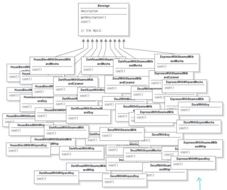
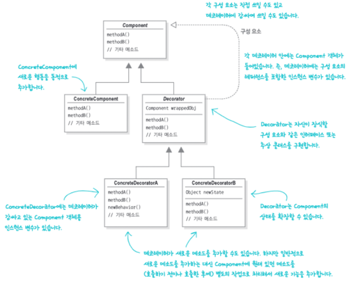

# Cafe
: 다양한 메뉴의 조합이 가능한 카페 시뮬레이션

---

### [1번구현] 최상위 추상클래스 Beverage를 상속 --- :x:
* 각각의 메뉴클래스 생성 ==> **메뉴 폭발**..
* 

### [2번구현] 첨가물을 Beverage 추상클래스의 인스턴스 변수 --- :x:
* milk, mocha, whip... 의 첨가물을 boolean타입의 인스턴스 변수로 추가
* 각각 첨가물에 대한 유무를 setter()를 이용해 값을 넣어줌
* 서브클래스의 cost()가 슈퍼클래스.cost()를 오버라이딩 하여 구현됨
* (단) 모든 음료클래스가 불필요한 첨가물에 대한 정보도 항상 포함하게 됨

```java
public class Super {

    private boolean condiment1;
    private boolean condiment2;
    // ...

    public void setCondiment1(boolean condiment1) {
        this.condiment1 = condiment1;
    }
    
    public void setCondiment2(boolean condiment2) {
        this.condiment2 = condiment2;
    }
    
    public double hasCondiment1() {
        return condiment1 ? 500 : 0;
    }
    
    public double cost() {
        // hasCondiment method에 따라 price를 구함
    }
}

public class Sub {
    
    private double subPrice;
    
    public double cost() {
        return super.cost() + subPrice;
    }
}

public class Main {
    
    public static void main(String[] args) {
        Sub sub = new Sub();
        sub.setCondiment1(true);
        double price = sub.cost();
    }
}
```

---

### [3번구현] Decorator Pattern --- :white_check_mark:
* 첨가물을 모두 Beverage의 하위클래스로 선언
* Beverage 클래스를 Beverage 데코레이터로 감싸는 것
* (장) 객체에 추가 요소를 동적으로 더할 수 있고, 행동을 위임할 뿐만 아니라 추가 작업을 수행할 수 있음
* (장) 기존 코드는 건드리지 않아 코드 수정에 따른 버그나 의도하지 않은 부작용을 원천봉쇄
* (단) 구상 구성 요소로 특정 작업을 처리하는것이 어려워짐 (데코레이터로 감싸고나면 그 커피가 하우스블렌드인지 다크 로스트인지 알 수 없음)
* java.io 클래스 - `BufferedInputStream`, `ZipInputStream`, `FileInputStream`도 해당 패턴에 포함됨
* 

> Ex) DarkRoast Mocha Whip 커피
> 1. DarkRoast 객체
> 2. Mocha 객체로 장식
> 3. Whip 객체로 장식
> 4. cost() 메소드 호출 
