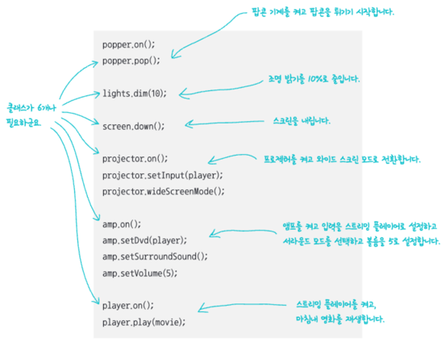
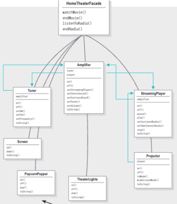

# HomeTheater
: 홈시어터를 이용하는 복잡한 과정을 담당하는 Facade 클래스 사용

### AS-IS

### TO-BE

* Facade 클래스에 관련있는 모든 서브시스템 요소를 포함
* 통합 인터페이스를 구성
* 클라이언트는 Facade 클래스만으로도 복잡한 작업을 한번에!
* `최소 지식 원칙(=데메테르 법칙)` : 가장 가까운 사이에만 상호작용을 허용
  * 객체 자체
  * 메소드에 매개변수로 전달된 객체
  * 메소드를 생성하거나 인스턴스를 만든 객체
  * 객체에 속하는 구성 요소
