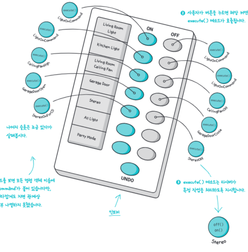

# RemoteControl
: 여러 디바이스를 하나의 리모컨에서 컨트롤하도록 하는 프로그램.   
커맨드 패턴으로 `작업을 요청하는 쪽`과 `작업을 처리하는 쪽`을 분리

### Command Pattern
> * 고객(`Client`) <-> 종업원(`Invoker`) <-> 요리사(`Receiver`)의 관계 
> * 사용자(`Client`) <-> **_리모컨(`Invoker`)_** <-> 조작하려는 기기(`Receiver`)
* 요청 내역을 캡슐화해서 서로 다른 요청에 따라 **매개변수화**
* command를 큐에 저장하여 _작업 큐, 스레드 풀, 스케줄러_ 등에 적용할 수 있음

